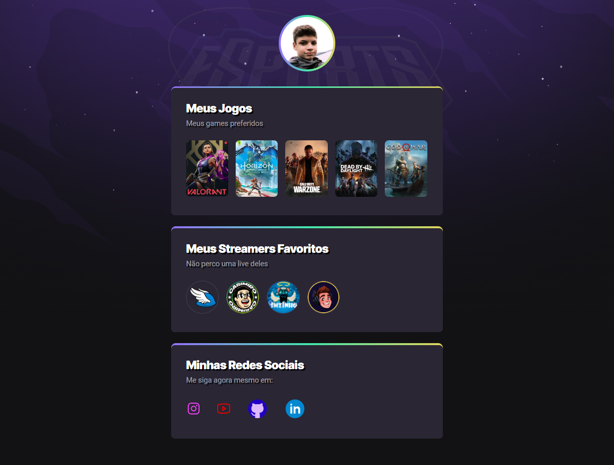

# NLW eSports - Trilha Explorer

Projeto construído no evento Next Level Week da Rockeseat, onde eu pude aprimorar muito minhas habilidades em CSS.

🔗[Clique aqui para acessar](https://pedrodevvv.github.io/Link-Page-NLW)

## 🛠️Tecnologias

* HTML
* CSS
* Git e Github

## 🧡 Contato

pedrohgs2004@gmail.com
Linkedin: https://www.linkedin.com/in/pedro-henrique-g-silva-a2100a23a/?originalSubdomain=br

## ✍️O que eu aprendi ?

Sem dúvidas a didática desse evento me chamou muito a atenção pela clareza, portanto pude absorver técnicas como transições e animações no CSS e também alternativas para identificação dos containers, impressionante como a mesma soluçaõ pode ser criada com códigos bem diferentes.